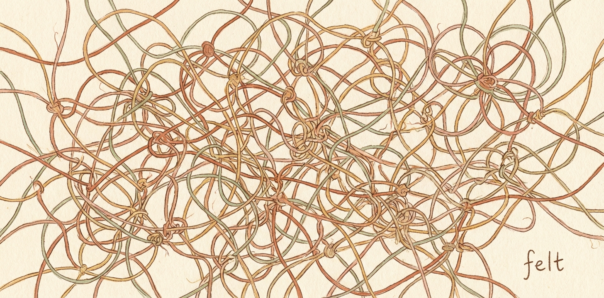

<p align="center">
  
</p>

<p align="center">
  <a href="https://github.com/cailmdaley/felt/actions/workflows/ci.yml"></a>
  <a href="LICENSE"></a>
</p>

# felt

DAG-native fiber tracker. Markdown files with dependencies.

## Why

Fibers have dependencies. Most trackers ignore this or bolt it on. Felt makes the DAG the center: `ready` shows what's actually unblocked, and the graph is always traversable.

Fibers are markdown files. Human-readable, version-controllable, greppable. No database, no sync, no lock-in.

## Install

```bash
brew install cailmdaley/tap/felt
```

Or with Go:

```bash
go install github.com/cailmdaley/felt@latest
```

## Quick Start

```bash
felt init                                        # creates .felt/
felt "Design API"                                # create a fiber
felt add "Implement endpoint" -a design-api      # depends on design
felt ready                                       # shows "Design API" (unblocked)
felt edit design-api -s active                   # mark active
felt edit design-api -s closed -o "REST, uses JWT"   # close with outcome
felt ready                                       # now shows "Implement endpoint"
```

## Core Concepts

### The DAG

Every fiber can depend on others via `-a`/`--depends-on`. This forms a directed acyclic graph (cycles are rejected). The DAG answers:

- `felt ready` — what's unblocked and open?
- `felt upstream <id>` — what does this depend on (transitively)?
- `felt downstream <id>` — what depends on this?
- `felt path <from> <to>` — how are two fibers connected?

### Status (opt-in)

Status tracking is optional. `felt "title"` creates a statusless fiber. Add `-s open` to enter tracking.

```
· untracked — no status, just a fiber
○ open      — tracked, not started
◐ active    — currently being worked on
● closed    — done, with outcome captured
```

Transition with `felt edit <id> -s active` and `felt edit <id> -s closed -o "outcome"`.

### Outcome as Documentation

The `-o` flag captures *what was learned, decided, or produced*. Closed fibers become searchable project memory:

```bash
felt ls -s closed             # what's been done
felt ls -s all "JWT"          # search all fibers
felt show <id> -d compact     # see outcome without full body
```

### Progressive Disclosure

`felt show` supports detail levels via `--detail` / `-d`:

| Level | What you see |
|---|---|
| `title` | Title + tags |
| `compact` | Metadata + outcome, upstream/downstream IDs |
| `summary` | Compact + lede paragraph, upstream/downstream with titles |
| `full` | Everything (default) |

```bash
felt show <id> -d compact       # "what was decided?"
felt upstream <id> -d compact   # outcomes of all upstream decisions
```

### Tags

Tags organize fibers across the graph:

```bash
felt "[pure-eb] Fix covariance bug"     # extracted from title
felt add "Fix bug" -t pure-eb -t urgent # via flag
felt tag design-api backend             # add to existing
felt untag design-api backend           # remove
felt ls -t pure-eb                      # filter (AND logic)
felt ready -t pure-eb                   # filter ready
```

### File Format

Fibers live in `.felt/<id>.md`:

```yaml
---
title: "Design API"
status: closed
tags: [backend, auth]
depends-on:
  - id: research-auth-patterns-a1b2c3d4
    label: auth approach
created-at: 2024-01-15T10:30:00Z
closed-at: 2024-01-16T14:20:00Z
outcome: "REST with JWT. See docs/api.md"
---

Optional body with notes, context, etc.
```

IDs are `<slug>-<8-hex-chars>`. Commands accept fuzzy matching:

```bash
felt show design-api-ac6b19c1    # full ID
felt show design-api              # prefix match
felt show ac6b19c1                # hex suffix only
felt show ac6b                    # even shorter
```

## Command Reference

### Creating & Closing

```bash
felt init                         # create .felt/
felt add <title>                  # create fiber
felt <title>                      # shorthand for add
felt edit <id> -s active          # enter tracking / mark active
felt edit <id> -s closed -o "outcome"  # close with outcome
felt rm <id>                      # delete (fails if dependents exist)
```

### Viewing

```bash
felt ls                           # tracked fibers (open/active)
felt ls -s all                    # all fibers including untracked
felt ls -s closed                 # by status
felt ls -t backend -t urgent      # by tags (AND)
felt ls -s all -t rule:           # tag prefix matching
felt ls -s all "query"            # search title, body, outcome
felt ls -s all -r "pattern"       # regex search
felt ready                        # open with all deps closed
felt show <id>                    # full details
felt show <id> -d compact         # structured overview
felt tree                         # dependency tree
```

### Editing

```bash
felt edit <id> --body "text"      # replace full body (destructive overwrite)
felt edit <id> --title "new"      # set title
felt edit <id> -s active          # set status
felt edit <id> -o "outcome"       # set outcome
felt comment <id> "note"          # add timestamped comment
felt tag <id> <tag>               # add tag
felt untag <id> <tag>             # remove tag
felt link <id> <dep-id>           # add dependency
felt link <id> <dep-id> -l "why"  # add labeled dependency
felt unlink <id> <dep-id>         # remove dependency
```

### Graph

```bash
felt upstream <id>                # transitive dependencies
felt upstream <id> -d compact     # with depth per item
felt downstream <id>              # what depends on this
felt path <from> <to>             # path between fibers
felt graph -f mermaid             # visualize (mermaid/dot/text)
felt check                        # validate integrity
```

### Integration

```bash
felt setup claude                 # install Claude Code session hook
felt setup codex                  # install Codex shell wrapper
felt hook session                 # output session context (used by hooks)
felt prime                        # alias for hook session
```

### Add Flags

```bash
-b, --body "text"                 # body text
-s, --status open                 # status (open, active, closed)
-a, --depends-on <id>             # dependency (repeatable)
-D, --due 2024-03-15              # due date
-t, --tag <tag>                   # tag (repeatable)
-o, --outcome "text"              # outcome
```

### Global Flags

```bash
-j, --json                        # JSON output
```
