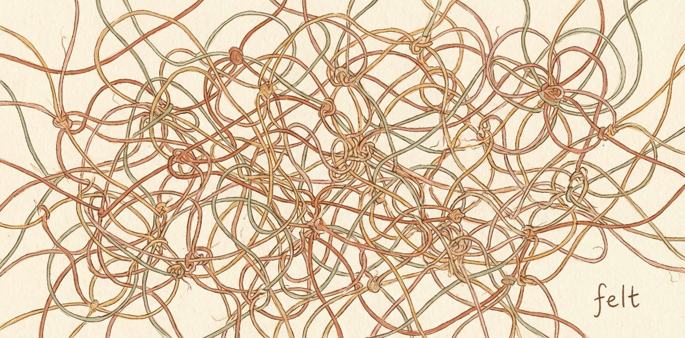

<p align="center">
  
</p>

<p align="center">
  <a href="https://github.com/cailmdaley/felt/actions/workflows/ci.yml"></a>
  <a href="LICENSE"></a>
</p>

# felt

Linked markdown files in a directed graph. A lightweight CLI for accumulating context — decisions, claims, tasks, questions — and keeping it searchable, traversable, and connected.

Fibers are the unit. Each one is a markdown file with YAML frontmatter, stored in `.felt/`. They can depend on each other, forming a DAG that you can walk: upstream to trace the reasoning behind a decision, downstream to follow its consequences into finer detail. Closing a fiber with an outcome captures what was learned. Over time, the graph becomes a persistent, navigable record of how a project arrived where it is.

There is no database or server — `.felt/` is a directory of markdown files that you can version-control, grep, and move between machines.

## Install

```bash
brew install cailmdaley/tap/felt
```

Or build from source:

```bash
go install github.com/cailmdaley/felt@latest
```

## Quick Start

```bash
felt init                                        # creates .felt/
felt "Use DES Y3 weights"                        # file a decision
felt add "Covariance estimation" -a des-y3       # depends on that decision
felt comment covariance "tried analytic, too slow"  # leave a breadcrumb
felt edit covariance -s closed -o "switched to jackknife — 10x faster, <2% bias"
```

A fiber can be anything: a task, a decision, a research claim, a question, a spec. The body carries detail and the outcome captures the conclusion. Dependencies connect them.

```bash
felt ready                       # what's unblocked?
felt upstream covariance         # what does this rest on?
felt downstream des-y3           # what follows from this?
felt ls -s all "jackknife"       # search across everything
```

## Fibers

A fiber is a `.felt/<id>.md` file:

```yaml
---
title: Covariance estimation
status: closed
tags: [pure-eb, methods]
depends-on:
  - id: use-des-y3-weights-a1b2c3d4
    label: weight choice
created-at: 2026-01-15T10:30:00Z
closed-at: 2026-01-16T14:20:00Z
outcome: "Jackknife covariance, 10x faster than analytic, <2% bias at all scales"
---

Tried analytic first — too slow for the number of bins we need.
Jackknife on 150 patches gives stable diagonal + off-diagonal.

## Comments
**2026-01-15 14:30** — tried analytic, too slow
**2026-01-16 09:15** — jackknife on 150 patches converges
```

IDs are `<slug>-<8hex>`. Commands accept prefix or hex-suffix matching: `felt show covariance`, `felt show a1b2`.

### Status

Status is opt-in. Most fibers don't need it. Add `-s open` when something needs tracking.

```
· untracked    just a fiber
○ open         tracked, not started
◐ active       in progress
● closed       done — outcome captured
```

### Tags

```bash
felt "[pure-eb] Covariance estimation"    # extracted from title
felt add "Fix bug" -t pure-eb -t urgent   # via flag
felt ls -t pure-eb                        # filter by tag
felt ls -t tapestry:                      # prefix match
```

### The DAG

Dependencies form a directed acyclic graph. Cycles are rejected.

```bash
felt link <id> <dep-id>           # add edge
felt link <id> <dep-id> -l "why"  # labeled edge
felt upstream <id>                # transitive dependencies
felt downstream <id>              # what depends on this
felt path <from> <to>             # how are two fibers connected?
felt ready                        # open fibers with all deps closed
felt tree                         # hierarchical view
felt graph -f mermaid             # export (mermaid/dot/text)
felt check                        # validate integrity
```

### Progressive Disclosure

```bash
felt show <id>                    # full body + metadata
felt show <id> -d compact         # metadata + outcome, no body
felt show <id> -d summary         # compact + lede paragraph
felt upstream <id> -d compact     # outcome chain
```

## Tapestry

Fibers tagged with `tapestry:<specName>` become nodes in a visual DAG that can be exported as a static site. Attaching evidence (metrics, figures) lets the viewer show what's fresh, stale, or missing.

```bash
# Create tapestry nodes
felt add "B-modes consistent with noise" -t tapestry:bmodes
felt add "Covariance matrix" -t tapestry:covariance
felt link bmodes covariance

# Evidence: results/tapestry/{specName}/evidence.json
# Written by your pipeline (e.g., Snakemake), not by hand
```

Evidence format:

```json
{
  "evidence": { "pte": 0.29, "chi2": 12.3, "dof": 10 },
  "output": { "figure": "bmodes.png" },
  "generated": "2026-01-15T00:09:04Z"
}
```

Export the DAG as a static site:

```bash
felt tapestry export                  # → ~/.felt/tapestries/data/{project}/
felt tapestry export --all-fibers     # include sidebar with all fibers
felt tapestry export --force          # re-copy all artifacts
```

Output goes to a clone of a [tapestry template repo](https://github.com/cailmdaley/tapestries) — a static viewer served via GitHub Pages. Each project writes its own `data/{name}/tapestry.json` + artifact images. The viewer is shared.

Staleness is computed automatically: if an upstream dependency's evidence is newer than yours, the node is marked stale.

## Agent Integration

Felt ships with skills for [Claude Code](https://claude.ai/claude-code) and [Codex](https://openai.com/index/codex/):

```bash
felt setup claude                 # hooks + skills for Claude Code
felt setup codex                  # shell wrapper + skills for Codex
felt setup skills                 # install skills only
felt setup skills --update        # update skills (overwrites local changes)
felt setup skills --link <path>   # symlink to source checkout (dev mode)
```

The session hook (`felt hook session`) prints active and ready fibers at the start of each conversation, giving the agent context about ongoing work.

### Bundled Skills

| Skill | Purpose |
|-------|---------|
| **felt** | Filing fibers from conversation — session extraction, transcript processing, archiving |
| **tapestry** | Recording scientific work — when to file claims, evidence format, tapestry conventions |
| **constitution** | Drafting specs for autonomous iteration loops |
| **ralph** | Executing those loops — survey, contribute, exit |

## Commands

```bash
# Create & close
felt init                         felt add <title>
felt <title>                      felt edit <id> -s closed -o "..."
felt rm <id>                      felt comment <id> "note"

# View & search
felt ls                           felt ls -s all "query"
felt ls -t tag                    felt ls -r "regex"
felt ready                        felt show <id> [-d level]
felt tree                         felt graph -f mermaid

# Edit
felt edit <id> --title "..."      felt edit <id> --body "..."
felt edit <id> -s active          felt edit <id> -o "..."
felt tag <id> tag                 felt untag <id> tag
felt link <id> <dep>              felt unlink <id> <dep>

# Graph
felt upstream <id>                felt downstream <id>
felt path <from> <to>             felt check

# Tapestry
felt tapestry export [--all-fibers] [--force] [--name x] [--out dir]

# Integration
felt setup claude|codex|skills    felt hook session
felt update                       felt prime
```

### Flags

```bash
# felt add
-b, --body "text"                 -s, --status open|active|closed
-a, --depends-on <id>             -t, --tag <tag>
-D, --due 2024-03-15              -o, --outcome "text"

# global
-j, --json
```

## License

[MIT](LICENSE)
