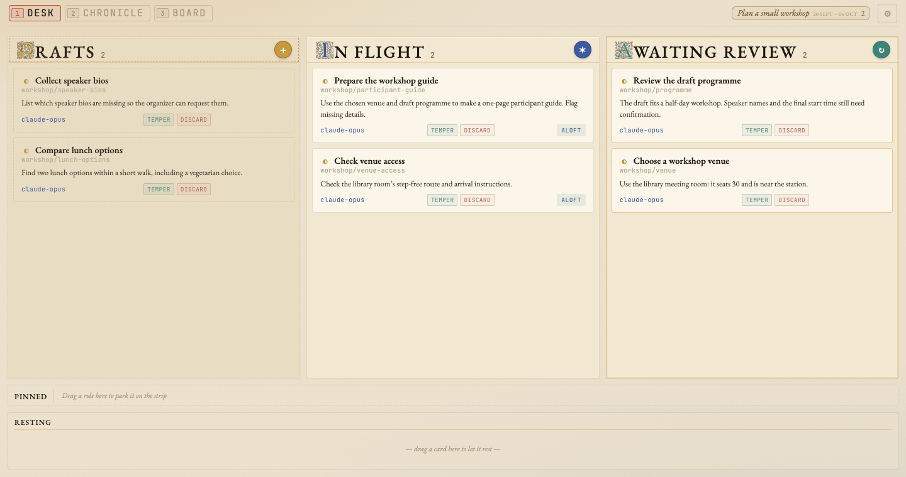

# felt

When a project spans several days or coding-agent sessions, its decisions often end up scattered across chat transcripts, issue comments, and half-finished notes.
felt gives those decisions, questions, and tasks a place beside the work: ordinary Markdown files that you and your agents can read, edit, search, and keep in Git.

**felt is a command-line tool for keeping project notes and tasks.**
Each note is called a **fiber**.
A fiber can record why you chose a method, hold a question you haven't answered, or describe work you want done.
You can use felt on its own, with any editor and no background service.

**Shuttle is an optional tool for assigning written tasks to coding agents.**
It uses the same fibers, starts agents in your project, and shows their progress and results in a browser board.
Start with felt for notes, or go to [Set up Shuttle](shuttle/setup.md) if you want agents to run tasks.

<video controls preload="metadata" playsinline
  poster="assets/shuttle-board-tour-poster.jpg"
  aria-label="Narrated tour of the Shuttle board: creating a task, starting a new session or resuming one, joining a meeting, opening a worker with Aloft, and reviewing a result">
  <source src="assets/shuttle-board-tour.mp4" type="video/mp4">
  <track kind="captions" srclang="en" label="English" default src="assets/shuttle-board-tour.vtt">
  <a href="assets/shuttle-board-tour.mp4">Download the narrated board tour (MP4)</a>.
</video>

<!-- tour-transcript:start -->
<details class="tour-transcript">
<summary>Transcript of the board tour (1:35)</summary>
<p><span class="tour-time">0:00</span> <em>Title card.</em> Here is the Shuttle board, and how to use its main controls.</p>
<p><span class="tour-time">0:04</span> <em>The Desk screenshot, with fictional workshop tasks in Drafts, In flight and Awaiting review.</em> These Desk lanes show drafts not yet started, work in flight, and results awaiting your review.</p>
<p><span class="tour-time">0:11</span> <em>The Drafts lane head, with its round plus button ringed.</em> To write a task yourself, click the plus on Drafts.</p>
<p><span class="tour-time">0:16</span> <em>Control guide of the Stash a constitution form: Title, optional Body, Host, Project and Agent, Kind (One-shot or Standing), and the Stash button.</em> The Stash form asks for a title, optional details, a project and an agent. One-shot is a single task. Standing repeats on a schedule. With One-shot selected, Stash saves a draft card.</p>
<p><span class="tour-time">0:31</span> <em>The In flight lane head, with its round star button ringed.</em> Or click the star on In flight, and describe an idea in your own words.</p>
<p><span class="tour-time">0:36</span> <em>Control guide of the New idea dialog: a large text box, a Meeting toggle, Host, Project and Agent, and the Spawn button.</em> Pick a project and press Spawn. An agent turns your words into a task, and its card appears a moment later.</p>
<p><span class="tour-time">0:44</span> <em>Control guide of an open card: a strip naming its agent and place, a message box with Meeting, New session and Resume, the next launch’s settings, History, and Discard and Temper.</em> Click any card to open it. The strip under its title, showing who works it and where, unfolds its actions. Write a message for the worker if you like, then choose how to send it. New session starts a fresh conversation, which reads the task and its notes from the top. If a worker is still running, the board asks before cutting it off. Resume requests the task’s previous conversation. Use it when finished work needs one more change.</p>
<p><span class="tour-time">1:11</span> <em>A running card in In flight, Prepare the workshop guide, with its Aloft badge ringed.</em> On a running card, Aloft opens the worker’s conversation, in a terminal, a browser, or a desktop app.</p>
<p><span class="tour-time">1:19</span> <em>Review the draft programme in Awaiting review: its outcome, then its Temper and Discard buttons, ringed in turn.</em> When a worker finishes, its outcome waits here for you. Read it, then press Temper to accept the result, or Discard to set it aside.</p>
<p><span class="tour-time">1:28</span> <em>End card: Set up Shuttle, at cailmdaley.github.io/felt/shuttle/setup/.</em> To try it, set up Shuttle on one machine, and start with one small task.</p>
</details>
<!-- tour-transcript:end -->

## Set up with your agent

We recommend asking your existing agent to help you set up Shuttle.
Give it this prompt:

```{.text .agent-prompt}
Read https://cailmdaley.github.io/felt/shuttle/agent-setup/ and help me set up Shuttle. Record this setup as a task on the board, and give me the board URL when it is ready.
```

The [setup guide](shuttle/setup.md) explains what to expect.
To use felt for notes on its own, follow the commands below.

## Keep a decision beside your project

Install felt on macOS or Linux:

```sh
curl -fsSL https://raw.githubusercontent.com/cailmdaley/felt/main/install.sh | sh
```

The installer includes both the `felt` and `shuttle` commands.
[Getting started](getting-started.md) covers other installation options and agent integration.

Suppose you are planning a small workshop and need to choose a venue.
From your project directory, create a place for notes and record the task:

```sh
felt init
felt add workshop-venue "Choose a workshop venue" -s open
```

This creates `.felt/workshop-venue/workshop-venue.md`.
Open it in your editor and write the question, evidence, or constraints below its metadata.
Once you've decided, record the answer:

```sh
felt edit workshop-venue -s closed \
  -o "Use the library meeting room: it seats 30 and is near the station."
felt show workshop-venue
```

The task is closed, but its answer stays in the project.
Search for it later with `felt ls -s all "workshop"`, or let an agent read it when preparing information for participants.

A fiber is a Markdown document with a small YAML header:

```markdown
---
name: Choose a workshop venue
status: closed
outcome: "Use the library meeting room: it seats 30 and is near the station."
---

We expect 25 people, and several will arrive by train.
The café is closer, but its back room only seats 18.
```

felt also stamps an identity and timestamps when it creates and edits fibers.
Status is optional: a note that records an existing decision doesn't need to become a task.

## Grow notes with the work

Keep related fibers in nested directories and connect them with `[[wikilinks]]` in their text.
Plots, PDFs, and reports can live beside the note that explains them.
The files remain readable in any editor, and `.felt/` can open as an [Obsidian](https://obsidian.md) vault.
Commit them to Git to keep their history; [cross-project stores](concepts/cross-project.md) let several projects share one collection.

The [agent integration](agents.md) gives Claude Code, Codex, and pi access to this same collection.
Agents receive project context at session start and instructions for recording what they learn.
The next session can read the conclusion and its reasoning without recovering a whole conversation.

## Run written tasks with Shuttle

With Shuttle, a fiber can also describe a result you want an agent to produce.
For example: “Prepare a one-page workshop guide using our venue decision and draft programme.
Include travel directions and the schedule; flag missing details for me to fill in.”
You choose the agent and project directory, and Shuttle starts the work.

A background service, called the **daemon**, watches the registered fiber collections and runs eligible tasks.
Its browser **board** lets you read and edit tasks, follow running agents, and review their results.
Agents write results and continuation notes back into the fiber, so another session can continue unfinished work.
You can run this on one machine or [connect several machines](shuttle/remotes.md).



The example board follows the same workshop: venue research, a draft programme, and a participant guide.

[The Shuttle overview](shuttle/index.md) explains the task workflow.
[Set up Shuttle](shuttle/setup.md) walks through installation and a first task on one machine.
Shuttle's service and board are optional; recording and searching notes with felt needs neither.

## Continue

| Your next step | Guide |
|---|---|
| Install felt and work through a first note | [Getting started](getting-started.md) |
| Decide when to track a task, nest notes, or link them | [Organizing](concepts/organizing.md) |
| Understand the file format | [Fibers](concepts/fibers.md) and [Frontmatter](concepts/frontmatter.md) |
| Keep plots, PDFs, and reports with a note | [Companion files](concepts/companions.md) |
| Give your coding agent project context | [Agent integration](agents.md) |
| Assign work to agents and follow it on a board | [Shuttle](shuttle/index.md) |
| Look up a command | [CLI reference](reference/cli.md) |

## License

Both Go CLIs and the board UI ship under the
[MIT License](https://github.com/cailmdaley/felt/blob/main/LICENSE). The shuttle
daemon (`daemon/lib/`) contains code derived from OpenAI's Symphony under the
[Apache License 2.0](https://github.com/cailmdaley/felt/blob/main/LICENSE-APACHE),
preserved in [`NOTICE`](https://github.com/cailmdaley/felt/blob/main/NOTICE).

## Contributing

Source and issues:
[github.com/cailmdaley/felt](https://github.com/cailmdaley/felt). To build or
patch felt, read
[CONTRIBUTING.md](https://github.com/cailmdaley/felt/blob/main/CONTRIBUTING.md)
for the setup, and
[AGENTS.md](https://github.com/cailmdaley/felt/blob/main/AGENTS.md) for the
architecture, build and lifecycle, deploy path, and invariants.
