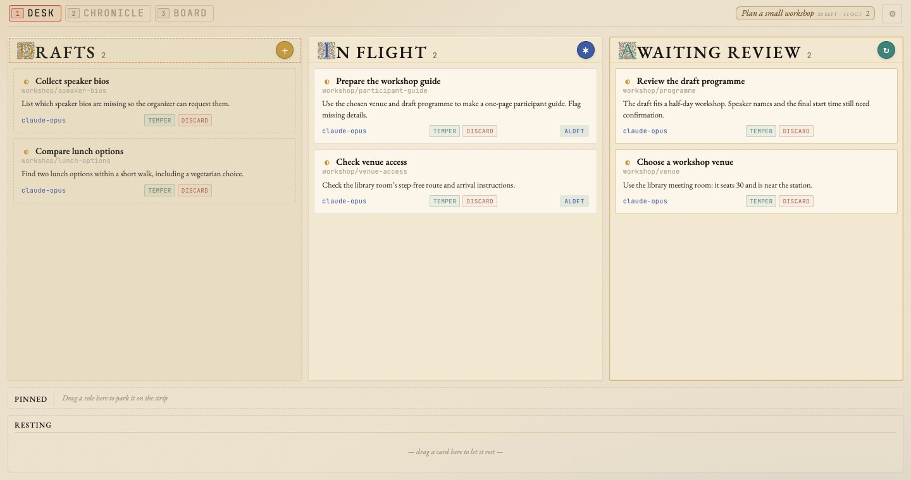
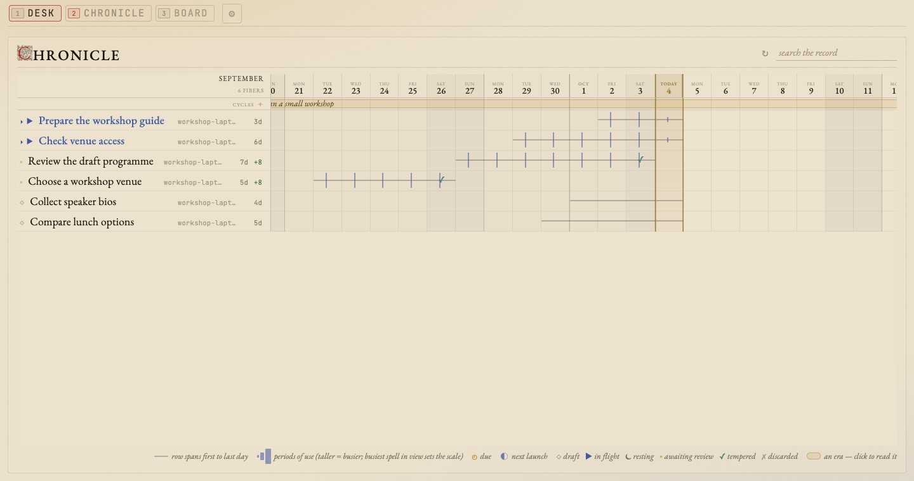

# The board

The daemon serves the board at `http://127.0.0.1:4000/`. It is one page with
three full-page views behind a hotkey row, `1`–`3`, and a settings sheet on
`⌘,`. Everything on it is a view over fibers the daemon already polls, plus
the host-local [ledgers](telemetry.md) — the board stores nothing of its own.

| Key | View | What it answers |
|---|---|---|
| `1` | **Desk** | What needs doing, and what is running right now |
| `2` | **Chronicle** | What a stretch of weeks was about |
| `3` | **Board** | What the work produced |
| `⌘,` | **Settings** | Every operator file, on any host in the fleet |

`#/desk`, `#/chronicle`, and `#/board` deep-link the views.
A constitution uses `#/board/<uid>@<owner>/<document>`; browser Back returns to the view you opened it from.

## Desk — the kanban

Three surfaces: the **Now** board of cards that need something, a **Pinned**
strip of perennial roles, and **Resting**, where snoozed work and standing
roles between runs wait.



*The cards use fictional workshop data.
Each card shows its fiber's `outcome`, so the venue decision is readable beside the guide that uses it.*

Where a card lands is two independent decisions: which column it belongs to,
and which horizon it sits on.

### Column

The browser computes column membership with `classifyFiber`
(`ui/src/board/KanbanRules.ts`). That function decides membership alone, and it
evaluates in this order:

| Column | Condition |
|---|---|
| Cycles | tagged `cycle` — checked first, unconditionally |
| Tempered | `closed` + `tempered: true` |
| Discarded | `closed` + `tempered: false` |
| Awaiting review | `closed`, `tempered` absent |
| In flight | live tmux worker with a shuttle block — liveness wins over everything below |
| Pinned | resting `kind: pinned` (`open` or `active`) |
| Scheduled | `active` + `kind: standing` — drawn in Resting, wearing its next launch |
| In flight | `active`, other kinds |
| Drafts | anything left, including `open` |

The cycle branch comes first on purpose. A [cycle](cycles.md) is an annotation
on the calendar rather than work, so it leaves classification before any
lifecycle question is asked — otherwise a stray "Autumn 2026" would sit in
Drafts forever.

Apart from that one tag, the classifier reads only `status`, `tempered`,
`kind`, and tmux liveness. Neither the daemon nor the board reads tags for
anything else.

### Horizon

Column says *which lane*; horizon says *desk or Resting*. It is computed by
`effectiveHorizon` from two frontmatter keys:

- `horizon: stashed` takes a card off the Now board and puts it in Resting.
  (The wire format and the API still say `stashed` everywhere; "Resting" is
  what the human is told, because that is what the surface means — deliberately
  paused work, not a bin of failures.)
- A `due:` day that is today or already past **overrides** a stored `stashed`
  and pulls the card back onto the desk. That override is what makes snooze a
  return ticket rather than a black hole. A *future* `due:` alone changes
  nothing: the card keeps its place and simply wears the date.

**Snooze** is the gesture that writes both. Drag a card and a drag horizon
appears under the tab strip — a slim row of upcoming days, plus a chip per
upcoming cycle. Drop on a day for `due:` + `horizon: stashed`; drop on a cycle
chip to land on that cycle's start (clamped to tomorrow if it is already
running); drop on today to put it back on the desk; drop into Resting to stash
it dateless.

### Gestures

Two gestures carry different meanings. **Drag-and-drop** advances the card's
state.
**The fiber page's controls** give you another worker on the same run.

Drag-to-tempered acts by kind: on a standing role it accepts and re-arms, on a
pinned role it accepts and re-parks to the strip, on a oneshot it writes the
terminus. The outcome stays: the last run's digest is the card's headline until
the next run writes its own.

Opening a Desk card enters its constitution's documents.
The fiber's own page carries a compact control band above the outcome: worker pill, message box with New session, Resume and Meeting, folded settings and session history, and Temper / Discard.
The message box starts at one line and grows on focus or with a draft.
Settings include the next launch's agent, effort, surface and kind, plus the card's due day and parent.
The Desk also offers Stash and Capture dialogs and Attach.

Images pasted or dropped into the message box wait there as thumbnails, each
with a × to remove it: PNG, JPEG, GIF or WebP, at most 10 MB each, 8 per send
and 25 MB in total. New session, Resume and Meeting first store them on the
host that owns the fiber (under its data directory's `attachments/`), then
send the message followed by one `[Image: <path>]` line per image, so the
worker opens each by path. If the upload fails nothing is sent and the box
says why. While a send is in flight every verb waits and the thumbnails are
frozen. A paste that carries text stays a text paste, even when the copying
app put an image beside it.

<a id="attach"></a>
### Open a worker

Worker pills on Desk cards, the reader navbar, and the fiber page open the worker's conversation. Fiber controls remain inline.
For terminal workers, the board can open Kitty; `shuttle attach <fiber>` works from other terminals too.
Claude sessions with Remote Control can open in the browser or Claude app, using your browser's preference in Settings.
Codex app workers use their native desktop link, with remote-access guidance on mobile.
See [Opening conversations](conversations.md) for the choices, prerequisites, and quick-access terminal setup.

### Desk keyboard

Bare keys act on the Desk when focus is outside an editable field. `h` / `←` and `l` / `→` move between columns and regions; `j` / `↓` and `k` / `↑` select the next or previous card. `g` and `G` select the first or last card in the current column. `Enter` / `o` opens the constitution, `Esc` / `u` clears selection, `/` opens Find, and `?` shows keyboard help. Movement skips empty regions and stops at the ends.

## Chronicle — where the time went

The activity stream bucketed per minute, joined to fibers through the session
and commit ledgers. See [Telemetry](telemetry.md) for what feeds it and what
happens when a ledger is absent.

Chronicle draws fibers as multi-day lifelines across calendar days, under a
strip of [cycle](cycles.md) bands. Activity is inked on each lifeline, one mark
per civil day; ahead of today a row carries only hollow marks for what is due
and what is armed.



*No fill, just marks on a line per fiber, so months of fibers stack without
drowning each other. The era strip is the same [cycle](cycles.md) data that
fences the Desk's Cycles column.*

Everything on the page is joined through the ledgers. A minute or a commit
that does not resolve to a fiber the board carries is not drawn at all, so work
started outside shuttle is invisible here — and nothing is ever attributed by
reading a `slug:` prefix out of a commit subject or a directory name.

**The record is fetched on demand.** The Desk's cards refresh every 15 s, and
Chronicle redraws its rows from them, but its temporal feeds — activity, the
session ledger, the commit ledger — are fetched when the view opens, again at
most every five minutes while it stays open, and whenever you ask with the
refresh control. Days already past are fetched once per open; scrolling back
fetches only the days newly in view. Nothing on the board asks for temporal
data while Chronicle is closed.

## Board — what the work produced

Hotkey `3` opens a contact sheet of constitutions with documents sent in the last 30 days.
A ribbon shows the twelve latest documents across the fleet.
Below it, each fiber has a folio with a live thumbnail, name, outcome, document count and host marks.
Recent work, Projects and Hosts regroup the sheet; Find filters names, paths and filenames.
Thumbnails load near the viewport under a shared budget and cannot run scripts.
Confirmed missing fibers' documents gather under **Unfiled** on their byte-owning host; an unreachable owner does not count as a missing fiber.

Opening a folio or receipt enters the reader: one selected page, inert receded neighbours, and a tab strip for the constitution.
The fiber page anchors its body, embedded files, opened body links and sent documents.
Repeated sends of the same owner/path are one page with multiple receipts.
Selection, constitution changes, metadata polls and the optional Constitutions sidebar preserve retained document instances and reading position.
The navbar's state-only worker pill opens the real conversation, just as on the Desk; fiber controls live inline on the fiber page rather than in a separate panel.
The fiber header shows status alone. Agent, effort, cadence, host and project directory belong to the folded settings line; the band's worker line is only its conversation action.
Document label bars show the title and arrival history, omit the agent, and name a host only for a document owned elsewhere. The fiber label shows its genuine last-change time.
Media, PDF and unsupported viewers add no title or provenance block inside the page. Audio/video use native transport controls; retained media pauses when receded or parked.
The Constitutions sidebar starts closed and remembers an explicit choice.
On phones, previous/next controls sit in a thumb bar, and browser Back returns to the originating view.

Bare reader keys work outside editable fields: h/l or left/right step pages; j/k step constitutions in sidebar order; down/up scroll about three lines, repeating while held; d/u scroll half a viewport; Space/Shift-Space scroll a full viewport.
g/G or Home/End select first/last pages, Enter/o toggle expand, and Escape unwinds popovers, expand, then returns.
Alt-left/right step pages and Alt-down/up step constitutions, including while typing.
A plain fiber reached by wikilink keeps the tab label **Note**.
The tablist keeps one Tab stop and moves focus with its selected tab.
HTML documents get first refusal on their own keys; native PDF and media viewers keep their controls.
`?` shows the shared keyboard help.

The receipt feed is `/api/v1/sent-files/all/composite`, which combines each host's event stream.
A host without an event stream contributes no receipts — see [Telemetry](telemetry.md).

## The board is optional, and the bundle is its own artifact

A fetched daemon already has it: CI builds the bundle and copies it into the
release's own `priv/`, so a downloaded daemon serves the board with no Node
anywhere in sight.

A checkout serves `ui/dist` from the checkout, and the repo does not ship that.
Build it with:

```bash
make ui        # npm ci when the lockfile changed, then npm run build
```

A fresh clone builds it fine — no private checkout needed (see [Sharp
edges](installation.md#sharp-edges)). `make build`, `make restart` and `make
all` all include this step; `SKIP_UI=1` leaves the bundle alone, which is how a
host that takes its bundle from elsewhere is built.

`SHUTTLE_UI_DIST` overrides both, pointing the daemon at any built bundle on
disk.

Without the bundle the root URL 404s with a hint, and the API stays fully
usable. If you change any `/api/v1/*` route, rebuild the bundle — a stale
bundle against a changed route table fails silently as a 404.

## Settings

`⌘,` opens the settings sheet, and so does a bare `,`: the board's own idiom
is bare keys, and a phone has no `⌘`. The ⚙︎ closing the tab strip does the
same with a pointer, pinned to the right edge on a phone so it never scrolls
out of reach. `Esc` closes it. It is an overlay rather than a fourth tab — the
three tabs are windows onto the work, and configuration is not work.

Settings opens to **Conversations**, where you choose the default Aloft action for Claude sessions.
The conversation-opening preference belongs to this browser and saves immediately.
Right-click Aloft to choose another supported opening route for that session without changing your default.

Host settings sit separately under **Worker hosts**.
The host picker selects which machine the remaining configuration addresses. The board is reachable from a phone and from a second hub, so the
machine you are configuring is usually not the one you are sitting at; every
read and write on the sheet carries the chosen host's origin and is
owner-routed to the daemon that owns the file. Configuring a remote needs that
remote's daemon to be recent enough to serve the config routes; an older one
says so.

| Section | What it holds |
|---|---|
| **Conversations** | The default for opening Claude conversations in this browser; worker execution stays unchanged |
| **Notes & tasks** | `stores.json` — the store list this daemon is configured with, and the symlinked substores it reaches through them |
| **Project folders** | `projects.json` — the checkouts Stash and Capture offer; adding one initializes its `.felt/` |
| **Worker agents** | The merged registry, each record marked with the layer it came from, with a default-effort select per agent (written as an `overrides` entry), over `agents.json` |
| **Connected hosts** | `remotes.json` as rows — how each remote is reached, whether it answered, what build it is running — plus the supervised tunnel jobs derived from it |
| **Access & listening** | Whether this is a personal or shared machine, and who can reach its daemon |
| **Daemon status** | Build, CLI contract, poll health, running workers, and the boot quarantine |

**Host configuration sections offer an advanced text editor for their files.** That is what makes
the sheet hold *all* the configuration rather than all of it there is a widget
for, and it is the only safe way to touch `remotes.json`: a structured round
trip drops every key the model does not know about, and that file carries
several (`auth`, `ssh_flags`, `tunnel.label`, per-entry timeouts) that
`shuttle remotes add` has no flag for. A save is refused unless the tool
that really reads the file accepts it first, and the refusal is that tool's own
sentence — see [the API reference](../reference/api.md#the-operator-files).

Two things the sheet will not do. It will not edit `~/.shuttle/host`: the
daemon freezes its host id at boot, so a file rewritten under a live daemon
would leave the CLI and the dispatcher disagreeing about what this machine is
called, and that is the worst failure this system has. And when `SHUTTLE_STORES`
or `SHUTTLE_PROJECTS` is set in a daemon's environment — which overrides the
file's contents outright — the section says so and turns editing off, rather
than letting you carefully fix a setting that has no effect.

A card that never appears at all is usually a dispatch question rather than a
board question — see [Diagnosing a missing card](lifecycle.md#diagnosing-a-missing-card).
